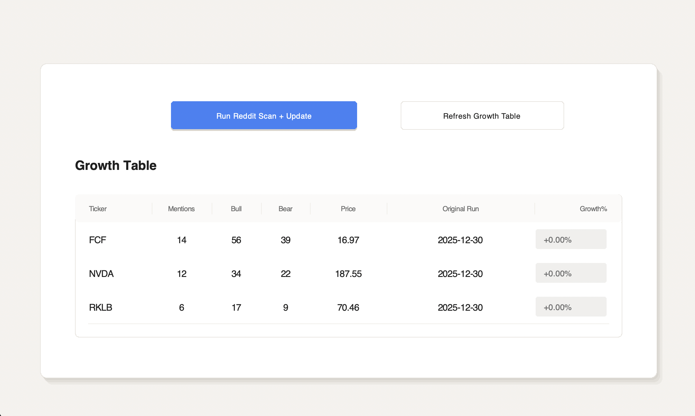

# Reddit Sentiment Scanner (Hype Scanner)
 
A Python app that scans Reddit posts/comments for ticker mentions, scores sentiment using bull/bear keywords, stores results in SQLite, and shows a clean UI growth table that tracks price performance since the first recorded run.

The point of this project is to find the coorelation of reddit "hype" to the price movements of stocks. Multiple subreddits exist which users comment and post their knowledge and opinions on specific companies. Reddit users are likely to react rather than predic; this project is prove whether either is true.

## What it does

- **Run Reddit Scan + Update**
  - Scans selected subreddits for ticker mentions
  - Tracks:
    - `mentions`
    - `bull`
    - `bear`
    - `score`
    - `time_of_run`
    - `price` (at the time of scan)
  - Saves first-seen tickers and their first-run values into **SQLite**

- **Refresh Growth Table**
  - Reads tickers from SQLite
  - Pulls current price using `yfinance`
  - Computes **Growth %** from the original run price
  - Displays a scrollable table in the UI

## Screenshots


## Requirements

- Python 3.10+ (recommended: Python 3.11)
- Internet connection (Reddit + yfinance)
- Reddit API credentials (required for scanning)

## Reddit API setup (required to run scans)

The app needs Reddit API credentials to access Reddit data via PRAW.

### 1) Create a Reddit App (get your keys)
1. Log in to Reddit.
2. Go to **User Settings → Safety & Privacy → Manage third-party app authorization**  
   (or search “Reddit apps prefs” and open the page).
3. Scroll to **Developed Applications** and click **Create App** (or **Create another app**).

After creating it, you will see:
- **client_id**
- **client_secret**

### 2) Create the `.env` file (in the project root)
In the **same folder as** `README.md` and `requirements.txt`, create a file named `.env`.
Here is the template that you **need** to follow:

REDDIT_CLIENT_ID=PASTE_CLIENT_ID_HERE
REDDIT_CLIENT_SECRET=PASTE_CLIENT_SECRET_HERE


Mac/Linux:
```bash
cd <your-project-folder>
touch .env
```

## Install + Run

### 1) Install dependencies
From the project root:

Mac/Linux:
```bash
python3 -m venv .venv
source .venv/bin/activate
pip install -r requirements.txt
python src/app.py
```

Windows (Powershell):
``` bash
python -m venv .venv
.venv\Scripts\Activate.ps1
pip install -r requirements.txt
python src/app.py
```

